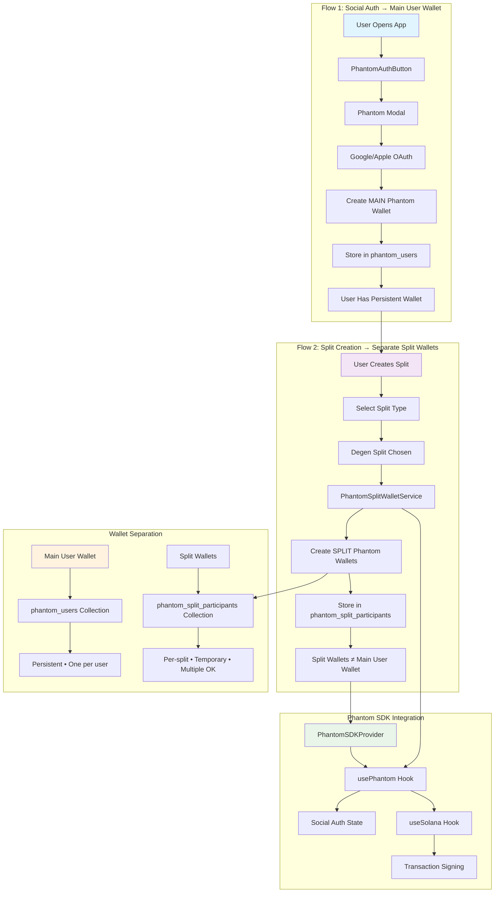

# Phantom Integration Plan: Social Auth + Split Wallets

## Executive Summary

This plan integrates Phantom's official SDKs for **two core flows**: (1) **social authentication** that creates Phantom wallets instead of embedded wallets, and (2) **split wallet creation** using Phantom wallets for participants. Using `@phantom/react-sdk`, we replace embedded wallet creation with Phantom-managed wallets while preserving Firebase auth as fallback. Focus on degen splits first, then expand to spend/fair. Zero breaking changes to existing flows.

---

## Architecture Diagram



**8 Key Design Decisions:**

1. **Parallel Operation**: Phantom runs alongside Firebase/embedded systems with feature flags for zero disruption.
2. **Unified Interfaces**: `UnifiedWalletService`/`UnifiedTransactionService` route between wallet types transparently.
3. **Social-First**: Google/Apple login creates wallets instantly vs embedded wallet seed phrases.
4. **Split-Scoped**: Phantom wallets created per split type (degen→spend→fair) for targeted rollout.
5. **Official SDK Priority**: Use `@phantom/react-sdk` by default; custom fallbacks only for gaps.
6. **Solana-First**: Full Solana support in Phase 1; EVM placeholders for Phase 3.
7. **Auto-Confirm**: Enable for micro-transactions to reduce friction in split payments.
8. **Portal Registration**: Required for production; enables advanced features and branding.

---

## Phase Implementation Plan

## 🎯 **Core Implementation: Two Focused Flows**

### **Flow 1: Social Auth → User's Main Phantom Wallet**
**Goal**: User gets ONE persistent Phantom wallet via social login.

**Implementation Steps:**
1. **App Entry**: Add `PhantomSDKProvider` to app root
2. **Auth Screen**: Replace Firebase buttons with `PhantomAuthButton`
3. **Social Flow**: Google/Apple OAuth → Phantom creates **main user wallet**
4. **Storage**: `phantom_users` collection with **persistent wallet address**
5. **Result**: User has **one main wallet** for all app activities

**Key Files:**
- `src/providers/PhantomSDKProvider.tsx`
- `src/components/auth/PhantomAuthButton.tsx`
- `src/services/auth/PhantomAuthService.ts`

### **Flow 2: Split Creation → Separate Split Wallets**
**Goal**: Each split gets its own Phantom wallets (separate from user's main wallet).

**Implementation Steps:**
1. **Split Type Check**: Detect degen/spend/fair splits
2. **Wallet Creation**: Create **separate Phantom wallets** per split participant
3. **User's Main Wallet**: Used for authentication, **NOT recreated**
4. **Split Wallets**: Temporary wallets for split transactions only
5. **Storage**: `phantom_split_participants` collection (separate from user wallets)
6. **Transaction Ready**: Split-specific wallets ready for payments

**Key Files:**
- `src/services/blockchain/wallet/phantomSplitWalletService.ts`
- `src/services/split/SplitWalletCreation.ts` (modified)
- `src/services/split/SplitWalletPayments.ts` (modified)

---

## Phase Implementation Plan

### Phase 1: Social Auth Foundation (1 Week)
**Deliverables:**
- ✅ Phantom Portal registration complete
- ✅ SDK installed and configured
- ✅ Social login button working
- ✅ Phantom wallet creation on signup
- ✅ Basic auth flow tested

**Testing:** Social login creates user + wallet, stores in Firestore.

### Phase 2: Split Wallet Integration (1 Week)
**Deliverables:**
- ✅ Degen split creation uses Phantom wallets
- ✅ Participant wallets created automatically
- ✅ phantom_split_participants populated
- ✅ Transaction signing works with Phantom
- ✅ Balance checking functional

**Testing:** Complete split flow with Phantom wallets, payment transactions.

### Phase 3: Production Polish (1 Week)
**Deliverables:**
- ✅ Error handling and retry logic
- ✅ Fallback to embedded wallets
- ✅ Performance optimization
- ✅ User education/tooltips
- ✅ Monitoring and analytics

**Testing:** E2E flows, error scenarios, user acceptance.

---

## 🔑 **Wallet Separation: Main User Wallets vs Split Wallets**

### **Critical Distinction:**
- **Main User Wallet**: Persistent, one-per-user, created during social login, stored in `phantom_users`
- **Split Wallets**: Per-split, potentially temporary, created for split participation, stored in `phantom_split_participants`

### **Why Separate Collections:**
```typescript
// Main user wallet (persistent)
phantom_users = {
  userId: "user123",
  phantomWalletAddress: "EPjFWdd5AufqSSqeM2qN1xzybapC8G4wEGGkZwyTDt1v", // Main wallet
  socialProvider: "google",
  createdAt: 1234567890
}

// Split wallet (per split)
phantom_split_participants = {
  userId: "user123",
  splitId: "split456",
  phantomWalletAddress: "DifferentAddressHere", // Split wallet ≠ main wallet
  mainWalletAddress: "EPjFWdd5AufqSSqeM2qN1xzybapC8G4wEGGkZwyTDt1v", // Reference
  splitType: "degen",
  isSplitWallet: true
}
```

### **User Experience:**
- **Main Wallet**: Used for app authentication, persists across sessions
- **Split Wallets**: Created automatically during split joining, may be temporary
- **No Confusion**: Users don't see wallet addresses, just seamless split participation

---

## 📋 **Implementation Checklist**

### **Social Auth Flow** ✅ **Covers Flow 1**
- [x] PhantomSDKProvider setup
- [x] PhantomAuthButton component
- [x] Social login (Google/Apple)
- [x] Phantom wallet creation
- [x] User profile storage
- [x] Auth state management
- [x] Deep link callback handling

### **Split Wallet Flow** ✅ **Covers Flow 2**
- [x] Split type detection (degen/spend/fair)
- [x] PhantomSplitWalletService
- [x] Participant wallet creation
- [x] phantom_split_participants storage
- [x] Transaction signing integration
- [x] Balance checking support
- [x] Error handling and fallbacks

---

## TypeScript Interface Definitions

### UnifiedWalletService
```typescript
interface UnifiedWalletInfo {
  type: 'embedded' | 'phantom' | 'none';
  address?: string;
  socialProvider?: 'google' | 'apple';
  splitType?: 'degen' | 'spend' | 'fair';
  embeddedWalletInfo?: any;
  phantomWalletInfo?: any;
}

class UnifiedWalletService {
  getWalletForContext(userId: string, context?: { splitType?: string }): Promise<UnifiedWalletInfo>;
  ensureWalletForSplit(userId: string, name: string, email: string, splitType: 'degen' | 'spend' | 'fair', provider?: 'google' | 'apple'): Promise<UnifiedWalletInfo>;
  getAllUserWallets(userId: string): Promise<{ embedded?: UnifiedWalletInfo; phantom: UnifiedWalletInfo[] }>;
  static isValidWalletAddress(address: string): boolean;
}
```

### UnifiedTransactionService
```typescript
interface TransactionParams {
  userId: string;
  amount: number;
  recipientAddress: string;
  memo?: string;
  context?: { splitType?: 'degen' | 'spend' | 'fair' };
}

interface TransactionResult {
  success: boolean;
  signature?: string;
  txId?: string;
  error?: string;
}

class UnifiedTransactionService {
  sendTransaction(params: TransactionParams): Promise<TransactionResult>;
  validateTransactionCapability(userId: string, context?: { splitType?: string }): Promise<{ canTransact: boolean; walletType: 'embedded' | 'phantom' | 'none'; error?: string }>;
  estimateTransactionFee(userId: string, amount: number, context?: { splitType?: string }): Promise<{ estimatedFee: number; walletType: 'embedded' | 'phantom' | 'none' }>;
}
```

### UnifiedAuthService
```typescript
interface UnifiedUser {
  id: string;
  name: string;
  email: string;
  avatar?: string;
  authType: 'firebase' | 'phantom';
  firebaseUser?: any;
  phantomUser?: any;
  wallets?: { embedded?: any; phantom: any[] };
}

interface UnifiedAuthContextType {
  currentUser: UnifiedUser | null;
  isLoading: boolean;
  isAuthenticated: boolean;
  signInWithGoogle(): Promise<{ success: boolean; error?: string }>;
  signInWithApple(): Promise<{ success: boolean; error?: string }>;
  signInWithPhantom(provider: 'google' | 'apple'): Promise<{ success: boolean; error?: string }>;
  signOut(): Promise<void>;
  getUserWallet(context?: { splitType?: string }): Promise<any>;
  ensureWalletForSplit(splitType: 'degen' | 'spend' | 'fair', provider?: 'google' | 'apple'): Promise<{ success: boolean; wallet?: any; error?: string }>;
  refreshUser(): Promise<void>;
  hasWallet(type?: 'embedded' | 'phantom'): boolean;
}
```

### PhantomSplitWalletService
```typescript
interface PhantomSplitWalletOptions {
  splitType: 'degen' | 'spend' | 'fair';
  socialProvider: 'google' | 'apple';
  spendingLimits?: { maxAmount?: number; maxDaily?: number; allowedTokens?: string[] };
  usePhantomWalletCreation?: boolean;
}

interface PhantomSplitWalletResult {
  success: boolean;
  walletAddress?: string;
  publicKey?: string;
  phantomUserId?: string;
  socialProvider?: string;
  splitType?: string;
  error?: string;
  requiresSocialAuth?: boolean;
  authUrl?: string;
}

interface PhantomSplitParticipant {
  userId: string;
  name: string;
  email?: string;
  phantomWalletAddress: string;
  socialProvider: 'google' | 'apple';
  splitType: 'degen' | 'spend' | 'fair';
  joinedAt: number;
}

class PhantomSplitWalletService {
  initializeForSplitWallet(options: PhantomSplitWalletOptions): Promise<void>;
  createSplitWallet(userId: string, name: string, email: string, options: PhantomSplitWalletOptions): Promise<PhantomSplitWalletResult>;
  handleSocialAuthCallback(authCode: string, state: string): Promise<PhantomSplitWalletResult>;
  getUserPhantomWallets(userId: string): Promise<PhantomSplitParticipant[]>;
  isPhantomSupportedSplitType(splitType: string): boolean;
  static getDefaultSpendingLimits(splitType: 'degen' | 'spend' | 'fair'): { maxAmount: number; maxDaily: number; allowedTokens: string[] };
}
```

---

## 🎯 **Core Flow Code Snippets**

### **Flow 1: Social Auth + Wallet Creation**

#### **1. App Setup with Phantom Provider**
```typescript
// src/App.tsx - Root app setup
import { PhantomSDKProvider } from './providers/PhantomSDKProvider';

export default function App() {
  return (
    <PhantomSDKProvider theme="dark">
      {/* Firebase auth remains available as fallback */}
      <YourExistingApp />
    </PhantomSDKProvider>
  );
}
```

#### **2. Social Login Button**
```typescript
// src/components/auth/AuthScreen.tsx
import { PhantomAuthButton } from '../components/auth/PhantomAuthButton';

export const AuthScreen = () => {
  const handlePhantomSuccess = (user) => {
    // User authenticated + wallet created
    navigateToHome(user);
  };

  return (
    <View>
      <Text>Welcome to WeSplit</Text>
      <PhantomAuthButton
        onSuccess={handlePhantomSuccess}
        onError={(error) => showError(error)}
      />
      {/* Firebase auth button as secondary option */}
    </View>
  );
};
```

#### **3. Phantom Auth Service - User's Main Wallet Creation**
```typescript
// src/services/auth/PhantomAuthService.ts
export class PhantomAuthService {
  async signInWithSocial(provider: 'google' | 'apple') {
    // Check if user already exists (reuse main wallet)
    const existingUser = await this.getPhantomUserByEmail(/* user email */);
    if (existingUser) {
      return { success: true, user: existingUser, wallet: existingUser.phantomWalletAddress };
    }

    // Create NEW main wallet only for new users
    const result = await phantomConnect.connect({
      preferredMethod: 'social',
      socialProvider: provider
    });

    if (result.success) {
      // Create persistent user profile with main Phantom wallet
      const user = await this.createPhantomUser(result.address!, provider);
      await this.storePhantomUser(user); // Main wallet - stored permanently

      return { success: true, user, wallet: result };
    }
  }
}
```

### **Flow 2: Split Creation + Phantom Wallets**

#### **4. Split Type Detection**
```typescript
// src/services/split/SplitWalletCreation.ts
import PhantomSplitWalletService from '../blockchain/wallet/phantomSplitWalletService';

export class SplitWalletCreation {
  static async createSplit(params: CreateSplitParams) {
    const { splitType, participants } = params;

    if (this.shouldUsePhantomWallets(splitType)) {
      return await this.createPhantomSplit(params);
    } else {
      return await this.createEmbeddedSplit(params); // Existing logic
    }
  }

  private static shouldUsePhantomWallets(splitType: string): boolean {
    return ['degen', 'spend', 'fair'].includes(splitType);
  }
}
```

#### **5. Phantom Split Wallet Creation (Separate from User's Main Wallet)**
```typescript
// src/services/split/SplitWalletCreation.ts
private static async createPhantomSplit(params: CreateSplitParams) {
  const phantomService = PhantomSplitWalletService.getInstance();

  // Create SEPARATE Phantom wallets for split participants
  // NOTE: These are different from the user's main Phantom wallet
  const phantomParticipants = await Promise.all(
    params.participants.map(async (p) => {
      // Check if participant already has a main Phantom wallet
      const mainWallet = await this.getUserMainPhantomWallet(p.userId);

      if (mainWallet) {
        // User has main wallet - can reuse for split OR create separate split wallet
        // For now, create separate split wallet to keep concerns separated
        const walletResult = await phantomService.createSplitWallet(
          p.userId,
          p.name,
          p.email || '',
          {
            splitType: params.splitType,
            socialProvider: mainWallet.socialProvider // Reuse provider preference
          }
        );

        return {
          ...p,
          walletAddress: walletResult.walletAddress!,
          phantomWallet: true,
          splitWallet: true, // Mark as split-specific wallet
          mainWalletAddress: mainWallet.phantomWalletAddress // Reference to main wallet
        };
      } else {
        // User doesn't have main Phantom wallet - create one
        const walletResult = await phantomService.createSplitWallet(
          p.userId,
          p.name,
          p.email || '',
          {
            splitType: params.splitType,
            socialProvider: 'google'
          }
        );

        return {
          ...p,
          walletAddress: walletResult.walletAddress!,
          phantomWallet: true,
          splitWallet: true
        };
      }
    })
  );

  // Store split participant data (separate from main user wallets)
  await this.storePhantomSplitParticipants(phantomParticipants, params.splitType);

  return { success: true, participants: phantomParticipants };
}
```

#### **6. Firestore Storage - Separate Collections for User vs Split Wallets**
```typescript
// SEPARATE COLLECTIONS to avoid confusion

// Main user wallets (persistent, one per user)
private static async storePhantomUser(user: PhantomUser) {
  const { db } = await import('../../config/firebase/firebase');
  const { doc, setDoc } = await import('firebase/firestore');

  await setDoc(doc(db, 'phantom_users', user.id), {
    id: user.id,
    name: user.name,
    email: user.email,
    phantomWalletAddress: user.phantomWalletAddress, // MAIN wallet
    socialProvider: user.socialProvider,
    createdAt: user.createdAt,
    lastLoginAt: user.lastLoginAt
  });
}

// Split participant wallets (per split, potentially temporary)
private static async storePhantomSplitParticipants(participants: any[], splitType: string) {
  const { db } = await import('../../config/firebase/firebase');
  const { collection, addDoc } = await import('firebase/firestore');

  const batch = participants.map(p =>
    addDoc(collection(db, 'phantom_split_participants'), {
      userId: p.userId,
      splitId: /* split ID */,
      name: p.name,
      phantomWalletAddress: p.walletAddress, // SPLIT wallet (different from main)
      mainWalletAddress: p.mainWalletAddress, // Reference to user's main wallet
      socialProvider: p.socialProvider,
      splitType,
      joinedAt: Date.now(),
      isSplitWallet: true // Mark as split-specific
    })
  );

  await Promise.all(batch);
}
```

#### **7. Transaction Signing with Phantom Wallets**
```typescript
// src/services/split/SplitWalletPayments.ts
import { UnifiedTransactionService } from '../blockchain/transaction/UnifiedTransactionService';

export class SplitWalletPayments {
  static async processSplitPayment(participantId: string, amount: number, splitId: string) {
    // Get participant's wallet (Phantom or embedded)
    const walletInfo = await this.getParticipantWallet(participantId, splitId);

    if (walletInfo.type === 'phantom') {
      // Use Phantom signing
      const txResult = await UnifiedTransactionService.sendTransaction({
        userId: participantId,
        amount,
        recipientAddress: splitWalletAddress,
        context: { splitType: 'degen', splitId }
      });
      return txResult;
    } else {
      // Use existing embedded wallet logic
      return await this.processEmbeddedPayment(participantId, amount);
    }
  }
}
```

#### **8. Deep Link Callback Handling**
```typescript
// src/services/core/deepLinkHandler.ts
import PhantomSplitWalletService from '../blockchain/wallet/phantomSplitWalletService';

export const handleDeepLink = async (url: string) => {
  if (url.startsWith('wesplit://auth/phantom-callback')) {
    const urlObj = new URL(url);
    const authCode = urlObj.searchParams.get('code');
    const state = urlObj.searchParams.get('state');

    if (authCode && state) {
      const result = await PhantomSplitWalletService.getInstance()
        .handleSocialAuthCallback(authCode, state);

      if (result.success) {
        // Complete authentication flow
        navigation.navigate('Home', { user: result.user });
      }
    }
  }
};
```

#### **9. Error Handling & Fallback**
```typescript
// src/hooks/usePhantomErrorHandler.ts
export const usePhantomErrorHandler = () => {
  const handleSplitWalletError = async (error: any, participantId: string) => {
    if (error.message?.includes('Phantom not available')) {
      // Fallback to embedded wallet
      return await createEmbeddedWalletForParticipant(participantId);
    }

    if (error.message?.includes('Social auth failed')) {
      // Show retry with different provider
      showProviderSelectionDialog();
      return;
    }

    // Show generic error
    showErrorDialog(error.message);
  };

  return { handleSplitWalletError };
};
```

#### **10. Wallet Balance Checking**
```typescript
// src/services/split/SplitWalletPayments.ts
static async getParticipantBalance(participantId: string, splitId: string): Promise<number> {
  const walletInfo = await this.getParticipantWallet(participantId, splitId);

  if (walletInfo.type === 'phantom') {
    // Check balance via Solana connection
    const { optimizedTransactionUtils } = await import('../shared/transactionUtilsOptimized');
    const connection = await optimizedTransactionUtils.getConnection();
    const balance = await connection.getBalance(new PublicKey(walletInfo.address));
    return balance / LAMPORTS_PER_SOL;
  } else {
    // Use existing embedded wallet balance logic
    return await this.getEmbeddedWalletBalance(participantId);
  }
}
```

#### **11. Spending Limits for Split Wallets**
```typescript
// src/services/blockchain/wallet/phantomSplitWalletService.ts
export class PhantomSplitWalletService {
  static getDefaultSpendingLimits(splitType: 'degen' | 'spend' | 'fair') {
    const limits = {
      degen: { maxAmount: 100, maxDaily: 500 }, // Higher for gambling
      spend: { maxAmount: 50, maxDaily: 200 },  // Moderate for spend
      fair: { maxAmount: 25, maxDaily: 100 }    // Conservative for fair
    };

    return {
      ...limits[splitType],
      allowedTokens: ['EPjFWdd5AufqSSqeM2qN1xzybapC8G4wEGGkZwyTDt1v'] // USDC only
    };
  }
}
```

#### **12. Cross-Device Sync**
```typescript
// src/services/auth/PhantomAuthService.ts
export class PhantomAuthService {
  async restoreSession(): Promise<void> {
    try {
      // Phantom handles cross-device sync automatically
      // Check if user was previously authenticated
      const phantomUser = await this.getStoredPhantomUser();

      if (phantomUser) {
        // Validate wallet still exists and accessible
        const isValid = await this.validatePhantomWallet(phantomUser.phantomWalletAddress);
        if (isValid) {
          this.currentUser = phantomUser;
        }
      }
    } catch (error) {
      logger.error('Session restoration failed', error);
    }
  }
}
```

### 1. Phantom SDK Provider Setup (React Native)
```typescript
// src/providers/PhantomSDKProvider.tsx
import { PhantomProvider, AddressType } from '@phantom/react-sdk';

const PHANTOM_CONFIG = {
  appId: process.env.EXPO_PUBLIC_PHANTOM_APP_ID,
  providers: ['google', 'apple', 'phantom', 'injected'] as const,
  addressTypes: [AddressType.solana],
  authOptions: { redirectUrl: 'wesplit://auth/phantom-callback' }
};

export const PhantomSDKProvider: React.FC<{ children: ReactNode; theme?: 'dark' | 'light' }> = ({
  children,
  theme = 'dark'
}) => (
  <PhantomProvider
    config={PHANTOM_CONFIG}
    theme={theme === 'dark' ? darkTheme : lightTheme}
    appIcon="https://wesplit.app/icon.png"
    appName="WeSplit"
  >
    {children}
  </PhantomProvider>
);
```

### 2. Phantom Portal Environment Variables
```bash
# .env.production
EXPO_PUBLIC_PHANTOM_APP_ID=abc123def456ghi789jkl012
EXPO_PUBLIC_PHANTOM_APP_ORIGIN=https://wesplit.io
EXPO_PUBLIC_PHANTOM_REDIRECT_URI=wesplit://auth/phantom-callback

# Example values after portal registration
EXPO_PUBLIC_PHANTOM_APP_ID=ws_2eca5921-d3a4-4104-a70a-67e826a73491
EXPO_PUBLIC_PHANTOM_APP_ORIGIN=https://wesplit.io
EXPO_PUBLIC_PHANTOM_REDIRECT_URI=wesplit://auth/phantom-callback
```

### 3. Connect/Login Flow (Phantom Connect + Social)
```typescript
// src/components/auth/PhantomAuthButton.tsx
import { usePhantom, useModal } from '@phantom/react-sdk';

export const PhantomAuthButton: React.FC<{
  onSuccess: (user: any) => void;
  onError: (error: string) => void;
}> = ({ onSuccess, onError }) => {
  const { isConnected, user } = usePhantom();
  const { open } = useModal();

  const handlePress = async () => {
    if (isConnected && user) {
      onSuccess(user);
    } else {
      open(); // Shows Phantom connection modal
    }
  };

  return (
    <TouchableOpacity onPress={handlePress}>
      <Text>{isConnected ? `Connected as ${user?.email}` : 'Continue with Phantom'}</Text>
    </TouchableOpacity>
  );
};
```

### 4. Deep Link Handlers (iOS/Android)
```typescript
// src/services/core/deepLinkHandler.ts
import { Linking } from 'react-native';
import PhantomSplitWalletService from '../blockchain/wallet/phantomSplitWalletService';

export const handleDeepLink = async (url: string) => {
  if (url.startsWith('wesplit://auth/phantom-callback')) {
    // Extract auth code from URL
    const urlObj = new URL(url);
    const authCode = urlObj.searchParams.get('code');
    const state = urlObj.searchParams.get('state');

    if (authCode && state) {
      const result = await PhantomSplitWalletService.getInstance()
        .handleSocialAuthCallback(authCode, state);

      if (result.success) {
        // Navigate to split creation success
        navigation.navigate('SplitCreated', { walletAddress: result.walletAddress });
      }
    }
  }
};

// Register handler in App.tsx
useEffect(() => {
  const subscription = Linking.addEventListener('url', ({ url }) => {
    handleDeepLink(url);
  });
  return () => subscription.remove();
}, []);
```

### 5. Create Phantom Split Wallet
```typescript
// src/services/split/SplitWalletCreation.ts
import PhantomSplitWalletService from '../blockchain/wallet/phantomSplitWalletService';

export class SplitWalletCreation {
  static async createPhantomSplit(params: CreateSplitParams): Promise<SplitResult> {
    const phantomService = PhantomSplitWalletService.getInstance();

    // Create Phantom wallets for each participant
    const phantomParticipants = await Promise.all(
      params.participants.map(async (p) => {
        const walletResult = await phantomService.createSplitWallet(
          p.userId, p.name, p.email || '',
          { splitType: params.splitType, socialProvider: 'google' }
        );

        if (!walletResult.success) {
          throw new Error(`Failed to create wallet for ${p.name}`);
        }

        return { ...p, walletAddress: walletResult.walletAddress! };
      })
    );

    // Store in Firestore
    await this.storePhantomSplitParticipants(phantomParticipants, params.splitType);

    return { success: true, participants: phantomParticipants };
  }

  private static async storePhantomSplitParticipants(
    participants: any[], splitType: string
  ): Promise<void> {
    const { db } = await import('../../config/firebase/firebase');
    const { collection, addDoc } = await import('firebase/firestore');

    const batch = participants.map(p =>
      addDoc(collection(db, 'phantom_split_participants'), {
        userId: p.userId,
        name: p.name,
        email: p.email,
        phantomWalletAddress: p.walletAddress,
        socialProvider: 'google',
        splitType,
        joinedAt: Date.now()
      })
    );

    await Promise.all(batch);
  }
}
```

### 6. Sign & Send Solana Transaction
```typescript
// src/hooks/usePhantomWallet.ts
import { useSolana } from '@phantom/react-sdk';

export const usePhantomWallet = () => {
  const { solana } = useSolana();

  const signAndSendTransaction = async (transaction: any): Promise<{
    success: boolean; signature?: string; error?: string
  }> => {
    if (!solana?.isConnected) {
      return { success: false, error: 'Phantom not connected' };
    }

    try {
      const result = await solana.signAndSendTransaction(transaction);
      return { success: true, signature: result.hash };
    } catch (error) {
      return { success: false, error: error.message };
    }
  };

  const signMessage = async (message: string): Promise<{
    success: boolean; signature?: string; error?: string
  }> => {
    if (!solana?.isConnected) {
      return { success: false, error: 'Phantom not connected' };
    }

    try {
      const signature = await solana.signMessage(message);
      return { success: true, signature: signature.toString() };
    } catch (error) {
      return { success: false, error: error.message };
    }
  };

  return { signAndSendTransaction, signMessage };
};
```

### 7. Spending Limits Configuration
```typescript
// src/hooks/usePhantomSpendingLimits.ts
import { useAutoConfirm, NetworkId } from '@phantom/react-sdk';

export const usePhantomSpendingLimits = () => {
  const { enable, disable, status, supportedChains } = useAutoConfirm();

  const configureSpendingLimits = async (limits: {
    maxAmount: number;
    maxDaily: number;
    chains: NetworkId[];
  }) => {
    // Note: Official SDK spending limits are configured in Portal
    // Auto-confirm enables automatic approvals for configured limits
    await enable({ chains: limits.chains });
  };

  const showSpendingLimitConsent = () => {
    Alert.alert(
      'Spending Limits',
      `Allow automatic approval for transactions up to $${maxAmount}? This only applies to WeSplit split payments.`,
      [
        { text: 'Not Now', style: 'cancel' },
        { text: 'Enable', onPress: () => configureSpendingLimits(limits) }
      ]
    );
  };

  return { configureSpendingLimits, showSpendingLimitConsent, status };
};
```

### 8. Auto-Confirm for Micro-Transactions
```typescript
// src/components/split/SplitPaymentButton.tsx
import { useAutoConfirm, NetworkId } from '@phantom/react-sdk';

export const SplitPaymentButton = ({ amount, onPaymentComplete }) => {
  const { enable, status } = useAutoConfirm();

  const handlePayment = async () => {
    if (amount <= 10 && !status?.enabled) { // Micro-transaction
      // Enable auto-confirm for small payments
      await enable({ chains: [NetworkId.SOLANA_MAINNET] });
    }

    // Proceed with payment - will auto-confirm if enabled
    const result = await signAndSendTransaction(transaction);
    onPaymentComplete(result);
  };

  return (
    <Button
      title={amount <= 10 ? 'Pay Split (Auto-Confirm)' : 'Pay Split'}
      onPress={handlePayment}
    />
  );
};
```

### 9. Fallback to Embedded Wallet
```typescript
// src/services/blockchain/transaction/UnifiedTransactionService.ts
class UnifiedTransactionService {
  async sendTransaction(params: TransactionParams): Promise<TransactionResult> {
    const walletInfo = await unifiedWalletService.getWalletForContext(
      params.userId, params.context
    );

    switch (walletInfo.type) {
      case 'phantom':
        try {
          return await this.sendPhantomTransaction(params, walletInfo);
        } catch (error) {
          logger.warn('Phantom transaction failed, falling back to embedded', error);
          // Fall through to embedded
        }

      case 'embedded':
        return await consolidatedTransactionService.sendUSDCTransaction(params);

      default:
        return {
          success: false,
          error: 'No wallet available',
          signature: '',
          txId: ''
        };
    }
  }
}
```

### 10. Error Handling & Retry
```typescript
// src/hooks/usePhantomErrorHandler.ts
import { usePhantom } from '@phantom/react-sdk';

export const usePhantomErrorHandler = () => {
  const { disconnect } = usePhantom();

  const handleTransactionError = async (error: any, retryCount = 0): Promise<{
    shouldRetry: boolean; retryDelay?: number; fallbackToEmbedded?: boolean
  }> => {
    if (error.message?.includes('User rejected')) {
      return { shouldRetry: false, fallbackToEmbedded: true };
    }

    if (error.message?.includes('Network error') && retryCount < 2) {
      return { shouldRetry: true, retryDelay: 1000 * (retryCount + 1) };
    }

    if (error.message?.includes('Timeout')) {
      await disconnect(); // Reset connection
      return { shouldRetry: true, retryDelay: 2000 };
    }

    return { shouldRetry: false, fallbackToEmbedded: true };
  };

  const showRetryDialog = (error: string, onRetry: () => void, onFallback: () => void) => {
    Alert.alert(
      'Transaction Failed',
      error,
      [
        { text: 'Try Again', onPress: onRetry },
        { text: 'Use Embedded Wallet', onPress: onFallback },
        { text: 'Cancel', style: 'cancel' }
      ]
    );
  };

  return { handleTransactionError, showRetryDialog };
};
```

### 11. Multi-Chain Placeholders
```typescript
// src/hooks/useMultiChainPhantom.ts
import { useSolana, useEthereum } from '@phantom/react-sdk';

export const useMultiChainPhantom = () => {
  const { solana } = useSolana();
  const { ethereum } = useEthereum();

  // Solana operations (current)
  const sendSolanaTransaction = async (transaction: any) => {
    if (!solana?.isConnected) throw new Error('Solana not connected');
    return await solana.signAndSendTransaction(transaction);
  };

  // Ethereum operations (future)
  const sendEthereumTransaction = async (txParams: any) => {
    if (!ethereum?.isConnected) throw new Error('Ethereum not connected');
    return await ethereum.sendTransaction(txParams);
  };

  // Switch networks
  const switchToPolygon = async () => {
    if (!ethereum?.isConnected) throw new Error('Ethereum not connected');
    return await ethereum.switchChain(137); // Polygon
  };

  return {
    solana: { sendTransaction: sendSolanaTransaction },
    ethereum: { sendTransaction: sendEthereumTransaction, switchToPolygon }
  };
};
```

### 12. React Web SDK Setup
```typescript
// src/providers/PhantomWebProvider.tsx
import { PhantomProvider, ConnectButton, AddressType } from '@phantom/react-sdk';

export const PhantomWebProvider = ({ children }) => (
  <PhantomProvider
    config={{
      appId: process.env.REACT_APP_PHANTOM_APP_ID,
      providers: ['google', 'apple', 'phantom'],
      addressTypes: [AddressType.solana, AddressType.ethereum],
      authOptions: {
        redirectUrl: `${window.location.origin}/auth/phantom-callback`
      }
    }}
    theme="dark"
    appIcon="/icon.png"
    appName="WeSplit"
  >
    {children}
  </PhantomProvider>
);

// Usage in web app
export const WebWalletConnect = () => (
  <div>
    <ConnectButton />
    <ConnectButton addressType={AddressType.ethereum} />
  </div>
);
```

---

## Test Plan & Sample Test Cases

### Testing Tools
- **Unit Tests**: Jest + react-native-testing-library
- **Integration Tests**: Jest + mocked Phantom SDK
- **E2E Tests**: Detox (mobile) + Cypress (web)
- **Manual QA**: TestFlight + staging environment

### **Flow 1: Social Auth Testing**

| Test Type | Tool | Scope | Sample Test Cases |
|-----------|------|-------|-------------------|
| Unit | Jest | Auth service | ✓ PhantomAuthService.signInWithSocial creates user + wallet<br>✗ Invalid social provider throws error |
| Integration | Jest + mocks | Auth flow | ✓ Complete social login stores phantom_users document<br>✗ Auth callback failure shows retry option |
| E2E | Detox | Auth journey | ✓ Google login creates account and wallet instantly<br>✗ Network error during auth shows offline message |

**Sample Auth Tests:**
```typescript
describe('PhantomAuthService', () => {
  it('should create user and wallet on social login', async () => {
    const result = await phantomAuth.signInWithSocial('google');
    expect(result.success).toBe(true);
    expect(result.user).toBeDefined();
    expect(result.wallet.address).toMatch(/^EPj/);
  });

  it('should store user in phantom_users collection', async () => {
    await phantomAuth.signInWithSocial('google');
    const storedUser = await getPhantomUser(testUserId);
    expect(storedUser.socialProvider).toBe('google');
  });
});
```

### **Flow 2: Split Wallet Testing (Separate from Main User Wallets)**

| Test Type | Tool | Scope | Sample Test Cases |
|-----------|------|-------|-------------------|
| Unit | Jest | Wallet service | ✓ Split wallet ≠ main user wallet<br>✗ Main wallet not recreated during splits |
| Integration | Jest + Firestore | Split creation | ✓ phantom_split_participants separate from phantom_users<br>✗ Split wallet references main wallet correctly |
| E2E | Detox | Split flow | ✓ Split creation uses separate wallets<br>✗ Main user wallet persists unchanged |

**Sample Split Tests:**
```typescript
describe('Wallet Separation', () => {
  it('should create separate split wallet from main user wallet', async () => {
    // User has main wallet
    const mainWallet = await getPhantomUser(userId);
    expect(mainWallet.phantomWalletAddress).toBeDefined();

    // Create split wallet
    const splitResult = await phantomSplitService.createSplitWallet(
      userId, 'John', 'john@email.com',
      { splitType: 'degen', socialProvider: 'google' }
    );

    // Split wallet should be different from main wallet
    expect(splitResult.walletAddress).not.toBe(mainWallet.phantomWalletAddress);
    expect(splitResult.isSplitWallet).toBe(true);
  });

  it('should store split participants separately from users', async () => {
    await phantomSplitService.createSplitWallet(userId, 'degen', 'google');

    // Check separate collections
    const userWallets = await getPhantomUsers();
    const splitParticipants = await getPhantomSplitParticipants();

    // Split participant should reference main user wallet
    const participant = splitParticipants.find(p => p.userId === userId);
    expect(participant.mainWalletAddress).toBeDefined();
    expect(participant.isSplitWallet).toBe(true);
  });
});

// E2E Test - Complete Flow
describe('Degen Split Creation', () => {
  it('should create split with Phantom wallets for all participants', async () => {
    // Create split with 3 participants
    const splitResult = await createDegenSplit({
      participants: [user1, user2, user3],
      totalAmount: 30
    });

    // Verify all participants have Phantom wallets
    for (const participant of splitResult.participants) {
      expect(participant.phantomWallet).toBe(true);
      expect(participant.walletAddress).toMatch(/^EPj/);
    }

    // Verify Firestore storage
    const storedParticipants = await getAllPhantomSplitParticipants(splitResult.id);
    expect(storedParticipants.length).toBe(3);
  });
});
```

### **Error & Edge Case Testing**

**Social Auth Failures:**
- Network timeout during OAuth
- User cancels social login
- Invalid auth callback
- Provider account not verified

**Split Wallet Failures:**
- Social auth fails during split creation
- Phantom wallet creation timeout
- Duplicate wallet creation attempt
- Split type not supported

**Recovery Testing:**
- Retry social login with different provider
- Fallback to embedded wallet
- Resume interrupted split creation
- Handle partial participant creation

---

## Rollout Plan & Monitoring

### Feature Flags (Per Environment)
```typescript
// config/features.ts
export const PHANTOM_FEATURES = {
  production: { SDK_ENABLED: false, SOCIAL_LOGIN: false, SPLIT_WALLETS: false },
  staging: { SDK_ENABLED: true, SOCIAL_LOGIN: true, SPLIT_WALLETS: true },
  development: { SDK_ENABLED: true, SOCIAL_LOGIN: true, SPLIT_WALLETS: true }
};
```

### Rollout Strategy
1. **Week 1**: Enable SDK loading (no UI changes)
2. **Week 2**: Enable social login for 10% of users (canary)
3. **Week 3**: Enable split wallets for degen splits (50% rollout)
4. **Week 4**: Full rollout with monitoring

### Rollback Steps
1. **Immediate**: Set feature flags to false
2. **App Store**: Submit update disabling Phantom features
3. **Database**: Existing Phantom wallets remain but new creation disabled
4. **User Communication**: Notify affected users of temporary unavailability

### **Flow 1: Social Auth Metrics**
- **Auth Success Rate**: Social login completion > 95%
- **Wallet Creation Rate**: Successful wallet creation > 98%
- **Time to Auth**: Complete flow < 30 seconds (target: 95%)
- **Provider Split**: Google vs Apple adoption rates

### **Flow 2: Split Wallet Metrics**
- **Split Creation Success**: Degen splits with Phantom wallets > 95%
- **Participant Conversion**: % participants using Phantom wallets > 80%
- **Transaction Success**: Phantom wallet payments > 98%
- **Fallback Usage**: % users switching to embedded wallets < 5%

### **Cross-Flow Metrics**
- **User Retention**: Phantom users vs embedded users
- **Split Completion**: Phantom wallet splits vs embedded splits
- **Error Rate**: Phantom-related errors < 1%
- **Support Tickets**: Phantom issues < 5% of total

### **Monitoring Dashboard**
- **Auth Funnel**: Login attempts → Social auth → Wallet creation → Success
- **Split Funnel**: Split creation → Wallet assignment → Payment → Completion
- **Error Tracking**: Auth failures, wallet creation failures, transaction failures
- **Performance**: Auth time, wallet creation time, transaction signing time

---

## Acceptance Criteria

### **Flow 1: Social Auth Acceptance Criteria**
- [ ] **PhantomAuthService.signInWithSocial()** creates user + wallet successfully
- [ ] **phantom_users** collection populated with valid data
- [ ] **PhantomAuthButton** works on iOS/Android with proper theming
- [ ] **Deep link callbacks** handled correctly for auth completion
- [ ] **Session persistence** works across app restarts
- [ ] **Error handling** provides clear user feedback

### **Flow 2: Split Wallet Acceptance Criteria (Separate from Main User Wallets)**
- [ ] **PhantomSplitWalletService.createSplitWallet()** creates split wallets ≠ main user wallets
- [ ] **phantom_split_participants** collection separate from **phantom_users** collection
- [ ] **Split participants** reference main user wallets but use separate split wallets
- [ ] **Main user wallet** persists unchanged during split creation
- [ ] **Split wallets** marked as temporary/disposable per split
- [ ] **Transaction signing** works with split-specific Phantom wallets
- [ ] **Balance checking** functional for split wallet addresses
- [ ] **Error recovery** provides fallback to embedded wallets

### **Integration Acceptance Criteria**
- [ ] **UnifiedWalletService** resolves correct wallet type for all contexts
- [ ] **UnifiedTransactionService** routes transactions appropriately
- [ ] **No breaking changes** to existing embedded wallet flows
- [ ] **Feature flags** control all Phantom features per environment
- [ ] **Monitoring** captures all key metrics and error rates

### **Quality Gates**
- [ ] Unit tests cover both auth and split wallet flows
- [ ] E2E tests validate complete user journeys
- [ ] Manual QA on iOS/Android for both flows
- [ ] Performance benchmarks met for both flows
- [ ] Security review passed for Phantom integration

### Business Metrics
- [ ] User adoption: 50% of new users choose Phantom
- [ ] Transaction success: > 98% for both wallet types
- [ ] Support tickets: < 5% increase from Phantom features
- [ ] User satisfaction: > 4.5/5 rating for new flows

---

## Security & Privacy Checklist

### Authentication & Authorization
- [ ] No server-side private key storage (Phantom manages keys)
- [ ] JWT tokens expire within 24 hours
- [ ] Refresh tokens rotated on suspicious activity
- [ ] CSRF protection on auth callbacks
- [ ] Rate limiting: 10 auth attempts per minute per IP

### Data Protection
- [ ] Phantom wallet addresses encrypted at rest
- [ ] Social provider data minimal (email only)
- [ ] PII not shared with third parties
- [ ] User consent required for data collection

### Transaction Security
- [ ] Spending limits enforced server-side
- [ ] Transaction amounts validated before signing
- [ ] No raw private keys in memory/logs
- [ ] Secure random for transaction nonces

### Network Security
- [ ] HTTPS required for all Phantom callbacks
- [ ] Certificate pinning for Phantom API calls
- [ ] Request signing for sensitive operations
- [ ] DDoS protection on auth endpoints

---

## Sprint Backlog (2-Week Implementation)

### **Week 1: Social Auth Flow** (6 Tickets)
1. **Phantom Portal Registration** (S - 2h) - Mobile Engineer
   - Register WeSplit app on Phantom Portal
   - Configure domains and redirect URIs
   - Obtain App ID for configuration

2. **SDK Installation & Provider Setup** (S - 4h) - Mobile Engineer
   - Install @phantom/react-sdk@beta
   - Create PhantomSDKProvider component
   - Configure app root with provider

3. **PhantomAuthButton Component** (M - 6h) - Mobile Engineer
   - Create reusable auth button component
   - Handle social login flows (Google/Apple)
   - Integrate with existing auth screens

4. **Phantom Auth Service** (M - 8h) - Backend Engineer
   - Implement social authentication logic
   - Create user profiles with Phantom wallets
   - Store phantom_users in Firestore

5. **Deep Link Callback Handling** (M - 6h) - Mobile Engineer
   - Handle wesplit://auth/phantom-callback
   - Process auth completion and user creation
   - Navigate to home screen on success

6. **Auth Flow Testing** (M - 8h) - QA Engineer
   - Unit tests for auth service
   - E2E tests for social login flow
   - Error handling validation

### **Week 2: Split Wallet Flow** (7 Tickets)
7. **PhantomSplitWalletService** (M - 8h) - Backend Engineer
   - Create service for split wallet management
   - Implement wallet creation for participants
   - Handle social provider selection

8. **Split Creation Integration** (L - 12h) - Fullstack Engineer
   - Modify SplitWalletCreation.ts for Phantom support
   - Add split type detection (degen/spend/fair)
   - Integrate with existing split creation flow

9. **Phantom Participant Storage** (M - 8h) - Backend Engineer
   - Create phantom_split_participants collection (separate from phantom_users)
   - Store split wallet associations with references to main user wallets
   - Implement wallet separation logic

10. **Transaction Integration** (M - 8h) - Backend Engineer
    - Update SplitWalletPayments.ts for split-specific Phantom wallets
    - Implement UnifiedTransactionService routing for split wallets
    - Ensure balance checking works with split wallet addresses

11. **Error Handling & Fallbacks** (M - 8h) - Fullstack Engineer
    - Add retry logic for failed wallet creation
    - Implement fallback to embedded wallets
    - Create user-friendly error messages

12. **Split Wallet Testing** (L - 10h) - QA Engineer
    - Unit tests for wallet service
    - Integration tests for split creation
    - E2E tests for complete split flow

13. **Feature Flag Implementation** (S - 4h) - Fullstack Engineer
    - Add feature flags for both flows
    - Environment-specific configuration
    - Gradual rollout controls

**Total Estimate**: 20S + 32M + 22L = 74 hours across 3 engineers
**Risk Mitigation**: Feature flags allow instant rollback, comprehensive testing ensures reliability
